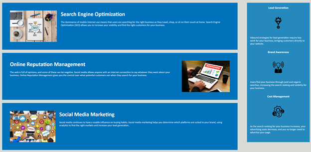

# Homework_Assignment_Week1
Homework Assignment for Week 1 by Jemima Siddiqui. 

# 01 About the Project - Code Refractor 

The Code Refractor project consists of the Horiseon homepage. The navigation bar consists of three options: Search Engine Optimisation, Online Reputation and Social Media Marketing. The homepage also consists of short descriptions of the aforementioned topic areas, as well as a panel on the right side of the page providing a short explanation for Lead Generation, Brand Awareness and Cost Management. The homepage is fully accessible and ensures that people with disabilities can access the homepage using assistive technologies such as image captions. 


## Acceptance Criteria

The Horiseon homepage fulfills the following acceptance criteria: 

* The source code consists of semantic HTML elements 
* In the source code, HTML elements follow a logical structure independent of styling and positioning 
* The webpage meets accessibility standards i.e. all icons and image elements consist of alt attributes 
* The heading attribute in the source code follow a sequential order 
* The title element is concise and descriptive

## Installation

### Viewing the homepage 

In order to access the Horiseon homepage, navigate to the following link: 
 [Horiseon Homepage](https://jemimasiddiqui.github.io/Homework_Assignment_Week1/). 

### Downloading Visual Studio Code 

 Download the latest version of Visual Studio to your local machine (Mac, Linux or Windows). Please use the following link to download the latest version of VS Code [Download VS Code](https://code.visualstudio.com/download). 

### Pulling the repository from Git 

If you would like to acess the source code (HTML and CSS files) and the images used in the Horiseon homepage, please navigate to the following public Github repository [Github Repository](https://github.com/JemimaSiddiqui/Homework_Assignment_Week1). 

* Clone the repository to your local desktop using the following steps:

  * 🔑 Use the terminal command `cd` to navigate to the directory where we want the repository located. In this case, we will save it to the Desktop. 

  ```bash
  cd Desktop
  ```

  * 🔑 Use the git command `git clone` followed by the URL copied from Github to clone the repo to our local machine.

  ```bash
  git clone <url>
  ```

  * 🔑 Use the `git clone` command creates a new directory with the same name as the repository. We navigate into our new directory using `cd`.

  ```bash
  cd Homework_Assignment_Week1
  ```
* After the repository has been cloned to your local machine, open the HTML and CSS files using Visual Studio application. The repository also contains the images used in the Horiseon homepage. 

## Usage 

This section contains instructions on how to use the Horiseon homepage. 

1. Navigation bar: 

The navigation bar contains three clickable menu options including: Search Engine Optimisation, Online Reputation and Social Media Marketing. Please note that since this is just the homepage, clicking the menu options will not redirect you to a new page. 


2. Homepage Body: 

For information about Search Engine Optimisation, Online Reputation and Social Media Marketing navigate to the body of the homepage. This section also contains information cards about Lead Generation, Brand Awareness and Cost Management. 



3. Accessibility: 

The homepage is fully accessible and ensures that people with disabilities can access a website using assistive technologies such as image captions. 


## Credits

* This README.md file was created through the help of the following tutorial: [Professional README Guide](https://coding-boot-camp.github.io/full-stack/github/professional-readme-guide).

## Features

* This webpage consists of the following features: 
  * A navigation bar with three clickable menu options: Search Engine Optimisation, Online Reputation and Social Media Marketing. 
  * Multiple cards explaining Search Engine Optimisation, Online Reputation and Social Media Marketing strategies. There are also cards that explain Lead Generation, Brand Awareness and Cost Management. 
  * Accesbility features to allow people with disability to easily navigate around the homepage. 
  * Copyright of Horiseon Solution Services 2019. 

---
© 2022 Trilogy Education Services, LLC, a 2U, Inc. brand. Confidential and Proprietary. All Rights Reserved.

